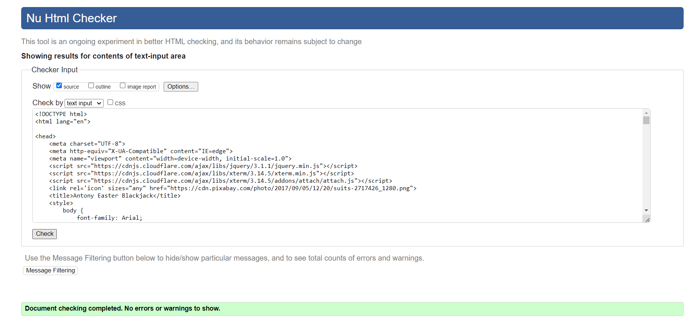

# BlackJack

## Overview

A Command-line game of BlackJack that users can play directly in the terminal. It's not the usual style of BlackJack people are used to playing but it has exactly the same outline.

[Click here to view the final deployment](https://blackjack--21-799b0dacef4d.herokuapp.com/)

## Contents

* [Overview](#Overview)
    * [How To Play](#How-To-Play)
        * [How To Win](#How-To-Win)
    * [User Stories](#User-Stories)
    * [Site Aims](#Site-Aims)
    * [How To Achieve Ahis](#How-To-Achieve-This)
    * [Game Flow Chart](#Game-Flow-Chart)
* [Features](#Features)
    * [Welcome Screen](#Welcome-Screen)
    * [Player name input](#Player-name-input)
    * [Introduction](#Introduction)
    * [Game Rules](#Game-Rules)
    * [How Many Games To Play](#How-Many-Games-To-Play)
    * [Game Load](#Game-Load)
    * [Player Hand](#Player-Hand)
    * [House Hand](#House_Hand)
    * [Hand Values](#Hand-Values)
    * [Hit, Stand or Quit](#Hit,-Stand-or-Quit)
        * [Hit](#Hit)
        * [Stand](#Stand)
        * [Quit](#Quit)
    * [Win Or Lose](#Win-Or-Lose)
    * [Play Again](#Play-Again)
    * [New Game](#New-Game)
    * [Goodbye messages](#Goodbye-messages)
* [Future Enhancement](#Future-Enhancement)
* [Classes](#Classes)
* [Testing](#Testing)
    * [Manual Testing](#Manual-Testing)
    * [Validators](#Validators)
* [Imports Used](#Imports-Used)
* [Bug Fixes](#Bug-Fixes)
* [Deployment](#Deployment)
* [Honorable Mentions](#Honorable-Mentions)
* [Credits](#Credits)

### How To Play

*  First thing to do is to decide how many games you want to play
*  Your hand will be automatically dealt
*  Once you have your hand, your total value of hand will be calculated and ahown below your hand.
*  You then need to decide to Hit or Stay using your hand value as an indicator of what to do.

### How To Win

The Aim is to get 21 or as close to it without going over.
If your hand has a higher value than the House hand without being over 21, you win.

### User Stories

As a user I want to be able to:

*  Create a username for my player
*  Give introduction the game
*  Be able to decide how many games to play
*  View my hand with a calculated total value
*  Read the rules
*  Decide to play again after first set of games is finished
*  Give a chooce to read rules after each game
 
### Site Aims

The site aims are:

*  Create a game where all the information you need is there and available
*  Keep the game running in a loop to avoid user input crashing the game
*  Give options to play over and over
*  Give the user a simple but enjoyable version of Blackjack

### How to achieve this

To achieve all the above, the site will:

1.  Give user the choice to read the rules and keep the choice available with every new game
*  Supply a welcome and a small amount of information about the game and how to progress through 
2.  Make sure that what ever the user inputs, the responsive is instructive
3.  Give the user a choice to play again after their chosen amount of games end
4.  Create a version of blackjack that has the same general rules and playstyle

### Game Flow Chart

I used a flow chart to work out the differnt steps to create the game. To build this flow chart I used [Flowchart Maker & Online Diagram Software](https://app.diagrams.net/)

## Features

### Welcome Screen

From the Welcome screen the player is prompted to tell me what they would like to be called.

### Player name input

The player is prompted to enter their name. The code is written to ensure the first letter of the name/names is capitalized. 

Error handling:
*  The name can not be a simple space, characters must be added
*  I have used the lower() inbuilt function to ensure any casing is excepted

### Introduction

Brief introduction and guidelines for navigating the game.

### Game Rules

The game rules section has a "Press enter to continue..." input in the middle, to give the player time to catch up with the reading before moving on.

Error handling:
*  Accepted values are (y,n) in any case. If the incorrect input is given, a prompt will remind the player of the options. 

### How Many Games

After selecting to play the game the player will be asked to input how many games they would like to play.

### Game Load

Once the amount of games has been decided, the player will be sent to "Game 1 out of ..."
The game has emojis to reflect the suit of the card.

### Player Hand

The player hand will have two visible values.

### House Hand

The house hand will have one visible value and one hidden value marked with a 'X'

### Hand Values

The total value of the player hand will be calculated for the player everythime a new card is added.

### Hit, Stand or Quit

The player will now need to make a descision to Hit, Stand or Quit.

Error handling:
*  Accepted values (h, hit, s, stand, q, quit) the player will need to enter a value listed in any casing

#### Hit

The hit descision will add another card to the hand and re calculate the value of the hand.
The game is programmed to accept (h or hit) which is not case sensitive. The player can keep inputting hit until they either go over 21 and bust, have an exact value of 21 or are happy to stand with their value. 

#### Stand

The stand descision will submit the players hand and calculate the winner of the game. The game is programmed to accept (s or stand) which is not case sensitive.

#### Quit

The player will have the option to quit each time they play a hand. A second prompt will follow, just to be sure they want to quit.

Quit:

Continue where you left off:

If no is selected, the player will just be able to continue with the game they were on before they entered quit.

#### Win Or Lose

Once the values have been calculated, a winner will be decided. After a small delay the player will be prompted to hit enter to continue.

Win:

Loss:

#### Play Again

Once the all the selected games have been played, the player will be asked if they wish to play again.

Error handling:

*  Accepted values are (y,n) in any case. If the incorrect input is given, a prompt will remind the player of the options.

#### New Game

Answering yes to play again will clear the terminal and re run the programme, giving the player the chance to recap on the rules.

Error handling:

*  Accepted values are (y,n) in any case. If the incorrect input is given, a prompt will remind the player of the options.

#### Goodbye messages

When the player decides to leave the game a goodbye message is displayed.

#### Typewritter Effect

I wanted to make my game a bit more appealing, which is why I decided to use a typewriter effect on most of the text. I also believe this will help the players stay on track with the reading. Sometimes I find that when you are suddenly thrown into a huge lump of text, it can be easy to skim over it without really reading it. In my opinion, this helps with that problem.

## Future Enhancement

There are a few things I would really like to add to this game in the future. Due to the nature of the course and having a deadline, this was not possible this time around.

#### Score Tracking:

I would like to add the ability for the user to see how many games they won out of their chosen game amount.

#### Game Area:

I would like to make a game area with the cards in the player's hand and the house's hand displayed the same as a normal playing card with the use of special characters.

#### Audio:

I would like to add sound effects for certain parts of the game. Such as card shuffling when a new game is dealt, an alert for hitting Blackjack, and a general win alert. On top of this, I'd like to have casino music playing in the background.
## Classes

For this project I used 4 different classes:

*  Deck
*  CardType
*  CardsInHand
*  PlayGame

#### Deck:

I used a class Deck to store the 52 card values.Which then uses import random to shuffle the cards and retrieve thecards from the deck.

#### CardType:

The CardType class is used to retrieve the suit and the value from the deck, which are then returned as a string for the main game area.

#### CardsInHand:

The CardsInHand class is used to extend the player's hand when the hit option is chosen.
This also includes calculating the value of the hand and taking note that if the value is over 21 and the hand has an ace included, the game will automatically remove 10 from the total value to make the ace the value of 1.
The class also creates the argument for keeping the House hand halfhidden until the hands are revealed at the end of the game.

#### PlayGame:

The PlayGame class gets the player's input for the number of games to play, which will then be increased by 1 until the amount is reached. Each time this is run, the cards are reshuffled and a new hand is dealt.
The class then gives it's next input for the player's decision to hit, stand or quit. Once all of these have run, the who wins function selects the appropriate print statement linked with the outcome of the game and prints both hands total value. 
## Testing

### Manual Testing:

Throughout the whole process of the project, manual testing was being done constantly in the codeanywhere terminal. After a small hiccup with codeanywhere not working anymore I moved over to VSCode and continued my manual testing in the terminal.

#### Manual testing consisted of:

*  Checking the "problems" tab in the terminal and correcting them as I went along. Common problems where, white space at the end of a line over 80 characters.

*  Running my game after small chunks of code to try and prevent being greated by an error.

*  Constantly running my game to check all inputs run in the correct way or return the correct prompts.

*  Lastly, constantly playing the game to be sure it's running in the correct way and none of the recent changes made have impacted the game in a bad way.

*  Using [Python Tutor](https://pythontutor.com/) for small parts of code to understand why I was getting an error.

### Validators

#### HTML:

I used the [HTML validator](https://validator.w3.org/) as I adjusted the background of the Code Institute template.

#### CSS:

Again, I checked the [CSS validator](https://jigsaw.w3.org/css-validator/) as I adjusted the positioning of the terminal in the Code Institute template. All tests passed with no errors.

#### Python:

I used [Python validator](https://pep8ci.herokuapp.com/) to check my python code. A few errors came up initially. However, these were all very minor and consisted of removing white space and shortening lines.
## Imports Used

#### Import time/sleep:

*  I used Import time to connect with the sleep import, allowing me to wait a certain amount of seconds before the next line is run

#### Import sys:

*  I used Import sys to control the typewriter effect which I used throughout the game

#### Import random:

* I used Import random to shuffle the deck.

#### From os Import system, name:

*  I used the "from os import system, name" Import the create the clear() function. Which I then used throughout the game to clear the terminal and keep the game clean

## Bug and Fixes

1. I had a bug that caused the game to produce an error once the calculation process was being called.
The error message was "Unexpected indent" and I was given a line number for the error.

Solution - The line number I was given by the error was actually the line below where the error was actually being cause. I had previously removed an "if" statement but not the "if" part. I wasn't giving the "if" statement anything to do, causing an indentation error on the line below.

2. After making a "while loop" for the quit game option, I caused an infinite loop.

Solution - I had set the "no" option for quitting the game to "continue" instead of "break", causing the loop to keep running over and over.

3. I had the game running, but it wasn't running correctly. When the game was over and the winner was being checked. The game would produce inconsistent results, with the house being the winner when it shouldn't have been.

Solution - In the who wins function, I had used the "get hand value" function with the player hand and house hand variables.
This should have been calling the "Total" function with the hand variables. Once fixed, the game ran smoothly as intended.  

## Deployment

#### Before Final Deployment:

Before the final deployment to Heroku, I had to follow a couple of steps from Code Institute to ensure my code would work once deployed.

*  Add a new line (\n) after all inputs due to an "odd quirk" in the software for the terminal
*  Use "pip3 freeze > requirements.txt" in the terminal to allow Heroku to find this file name and build the project

### Final Deployment To Heroku

1.  Create a Heroku account and log in
2.  Once signed in, head to "Create new app" on the main page of the site
3.  From there you can give your app a unique name, I used "blackjack--21"
4.  You then need to choose your region, as I'm in the UK I chose Europe
5.  Then click the "Create app" button
6.  This will bring you to the deploy tab, from here head over to the settings tab within the same line of tabs as the deploy
7.  click the button named "Reveal Config Vars" and in the "Key" input - PORT then in the "Value" imput - 8000
8.  Then click the "add" button 
9.  Scroll down to the "Buildpack" section and click "Add Buildpack"
10.  First select the "Python" option and click save changes
11.  Then click "Add Buildpack" again
12.  This time we want to add the "node.js" and click save changes 
13.  It's very important that you follow steps 11 and 12 in the correct order - add "Python" then add - "node.js"
14.  Head back to the deploy tab at the top of the page
15.  From the deploy tab, select GitHub as a deployment method
16.  Confirm you want to connect to GitHub
17.  Search for your repository name you used in GitHub
18.  Then click connect
19.  At this point you can chose to manually deploy the project each time you push your code to GitHub or automatically deploy everythime you push your code to GitHub. 
20.  If you chose to do the deployment manually, you will need to select a branch e.g "main" then select deploy branch
## Honorable Mentions

*  David Bowers - David has been a huge help throughout this project. The guidance and support he has given me is massively appreciated. All of the meetings I had with David were a pleasure to be part of.

*  Tutor support - Always reliable and quick to respond, it's always great to have them to reach out to.

*  My Family - As always, thanking my family is important. Over the last month, my head has been inside my laptop trying to understand and learn Python, but as always, they understand it's what needs to be done and they fully support it.

## Credits

*  Python OOP Tutorial series by Corey Schafer for general reference on working with classes - [View the Videos here](https://youtu.be/ZDa-Z5JzLYM)

*  The clear terminal function from [geeksforgeeks](https://www.geeksforgeeks.org/clear-screen-python/)

*  I used Unicode emoji's form [Unicode emoji's](https://unicode.org/emoji/charts/emoji-list.html#1f4a5) 

*  Favicon and background image both taken from [pixabay](https://pixabay.com/)

*  For inspiration and guidance I used a Python for Beginners YouTube video. [Python for Beginners](https://youtu.be/aryte85bt_M)

*  I used [Flow Chart](https://app.diagrams.net/#W1e68025906213c4f%2F1E68025906213C4F!21544) in my planning phase of the project

*  To convert my image to webp I used [Convertio](https://convertio.co/jpg-webp/)

*  [Stack overflow](https://stackoverflow.com/) for help with understand why certain errors where produced.

*  [Code Institute](https://codeinstitute.net/full-stack-software-development-diploma/?utm_term=code%20institute&utm_campaign=CI+-+UK+-+Search+-+Brand&utm_source=adwords&utm_medium=ppc&hsa_acc=8983321581&hsa_cam=1578649861&hsa_grp=62188641240&hsa_ad=635720257674&hsa_src=g&hsa_tgt=kwd-319867646331&hsa_kw=code%20institute&hsa_mt=e&hsa_net=adwords&hsa_ver=3&gad=1&gclid=CjwKCAjw5_GmBhBIEiwA5QSMxDdBQFGWkngoW1d8ZYG-HH5bBOLbVuKvc2GpQBXdJiTa7AItqhxecxoC_UIQAvD_BwE) for the template provided, this allowed me to display my game in a web based terminal

*  To Create my BLACKJACK heading I used [Patorjk](https://patorjk.com/software/taag/#p=display&f=Graffiti&t=Type%20Something%20)

*  I used a Typewritter effect for most of the text displayed in my game. I got this piece of code from [replit.com](https://replit.com/talk/learn/Typewriter-effect-Python/139897)

*  To write my Readme I used [readme.so](https://readme.so/) 